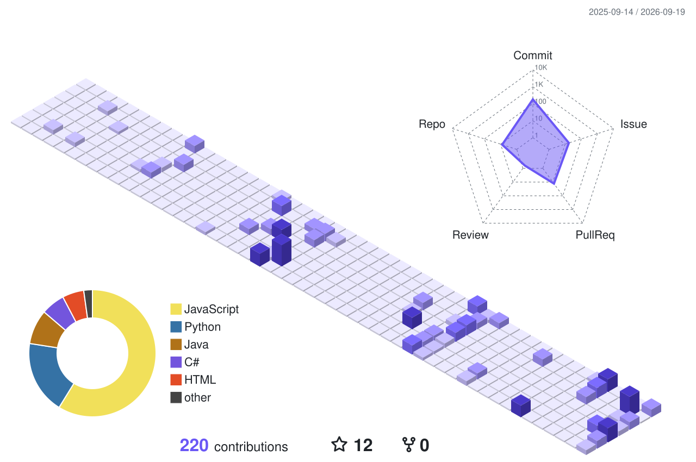
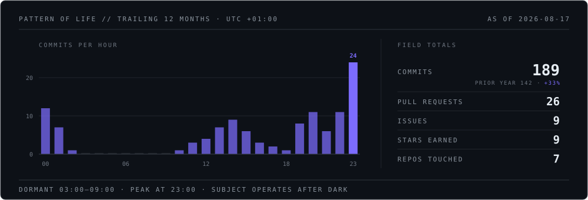

<picture>
  <source media="(prefers-color-scheme: dark)" srcset="assets/header-dark-anim.svg">
  <source media="(prefers-color-scheme: light)" srcset="assets/header-light-anim.svg">
  
</picture>

<code>CONTENTS</code> &nbsp; §01 SUBJECT &nbsp;&#183;&nbsp; §02 OPERATIONS &nbsp;&#183;&nbsp; §03 CAPABILITY &nbsp;&#183;&nbsp; §04 EXERCISES &nbsp;&#183;&nbsp; §05 SURVEILLANCE &nbsp;&#183;&nbsp; §06 CONTACT

<picture>
  <source media="(prefers-color-scheme: dark)" srcset="assets/rule-dark.svg">
  <source media="(prefers-color-scheme: light)" srcset="assets/rule-light.svg">
  
</picture>

## Builds systems. Breaks systems. Mostly on purpose.

Cybersecurity and cloud computing engineering student in Tunis. Currently on [Baitway](https://github.com/Givemeboga/Baitway) and [Fortify](https://github.com/Givemeboga/Fortify).

<picture>
  <source media="(prefers-color-scheme: dark)" srcset="assets/rule-dark.svg">
  <source media="(prefers-color-scheme: light)" srcset="assets/rule-light.svg">
  
</picture>

### `§ 01` &nbsp; SUBJECT PROFILE

| FIELD | ENTRY |
|:--|:--|
| `DESIGNATION` | Youssef Ben Chaouacha |
| `KNOWN ALIAS` | Gl1tchYB |
| `LAST SEEN` | Tunis, Tunisia |
| `OCCUPATION` | Cybersecurity and cloud computing engineering student |
| `SPECIALIZATION` | Building and breaking systems |
| `THREAT LEVEL` | Moderate. Escalates sharply near unpatched software. |

<picture>
  <source media="(prefers-color-scheme: dark)" srcset="assets/rule-dark.svg">
  <source media="(prefers-color-scheme: light)" srcset="assets/rule-light.svg">
  
</picture>

### `§ 02` &nbsp; ACTIVE OPERATIONS

<table>
  <tr>
    <td width="230" valign="top"><code>OP-01</code> <strong>BIOSCAN</strong> FastAPI &#183; React &#183; hybrid cloud</td>
    <td valign="top">Secure medical data analysis platform. Patient data goes in; patient data stays in. <a href="https://github.com/Givemeboga/BioScan">github.com/Givemeboga/BioScan</a></td>
  </tr>
  <tr>
    <td width="230" valign="top"><code>OP-02</code> <strong>FORTIFY</strong> Python &#183; open source</td>
    <td valign="top">Web application security scanner. Finds the holes before someone less polite does. <a href="https://github.com/Givemeboga/Fortify">github.com/Givemeboga/Fortify</a></td>
  </tr>
  <tr>
    <td width="230" valign="top"><code>OP-03</code> <strong>BAITWAY</strong> Python &#183; SOC tooling</td>
    <td valign="top">Phishing analysis and IOC threat triage for analysts. Reads the bait so you don’t have to. <a href="https://github.com/Givemeboga/Baitway">github.com/Givemeboga/Baitway</a></td>
  </tr>
</table>

<picture>
  <source media="(prefers-color-scheme: dark)" srcset="assets/rule-dark.svg">
  <source media="(prefers-color-scheme: light)" srcset="assets/rule-light.svg">
  
</picture>

### `§ 03` &nbsp; CAPABILITY ASSESSMENT

| DOMAIN | TOOLS | DEPTH |
|:--|:--|--:|
| `OFFENSIVE` | Kali, Bash, Python, Docker | `DAILY` |
| `CLOUD &amp; OPS` | Linux, Docker, Jenkins, GitHub Actions | `WORKING` |
| `WEB &amp; API` | FastAPI, React, TypeScript, Postgres | `WORKING` |
| `LOW LEVEL` | C, C++, C#, Java, Qt, Arduino | `COURSEWORK` |

  
<code>ANNEX A</code> &nbsp; FULL TOOL LIST

   
  
   
  
   
  
   
  

<picture>
  <source media="(prefers-color-scheme: dark)" srcset="assets/rule-dark.svg">
  <source media="(prefers-color-scheme: light)" srcset="assets/rule-light.svg">
  
</picture>

### `§ 04` &nbsp; FIELD EXERCISES

Flags recovered under controlled conditions. No systems were harmed that hadn't volunteered.

<picture>
  <source media="(prefers-color-scheme: dark)" srcset="assets/rule-dark.svg">
  <source media="(prefers-color-scheme: light)" srcset="assets/rule-light.svg">
  
</picture>

### `§ 05` &nbsp; SURVEILLANCE LOG

<code>OBSERVATION&nbsp;PERIOD</code> trailing 12 months &nbsp;&#183;&nbsp; <code>METHOD</code> aerial survey of the contribution calendar, re-flown nightly

<picture>
  <source media="(prefers-color-scheme: dark)" srcset="assets/activity-plate-dark.svg">
  <source media="(prefers-color-scheme: light)" srcset="assets/activity-plate-light.svg">
  
</picture>

Subject shows a pronounced tendency to commit after dark. No intervention planned.

<picture>
  <source media="(prefers-color-scheme: dark)" srcset="assets/rule-dark.svg">
  <source media="(prefers-color-scheme: light)" srcset="assets/rule-light.svg">
  
</picture>

### `§ 06` &nbsp; CONTACT PROTOCOL

<code>MAIL</code> &nbsp;<a href="mailto:youssef.ben.chaouacha@gmail.com">youssef.ben.chaouacha@gmail.com</a> 
<code>WEB&nbsp;</code> &nbsp;<a href="https://givemeboga.github.io/Portfolio/">givemeboga.github.io/Portfolio</a> 
<code>CTF&nbsp;</code> &nbsp;<a href="https://play.picoctf.org/users/Gl1tchYB">picoCTF / Gl1tchYB</a>

<picture>
  <source media="(prefers-color-scheme: dark)" srcset="assets/rule-dark.svg">
  <source media="(prefers-color-scheme: light)" srcset="assets/rule-light.svg">
  
</picture>

<strong>END OF FILE.</strong> This document is unclassified. The vulnerabilities it describes are not. &nbsp; 
